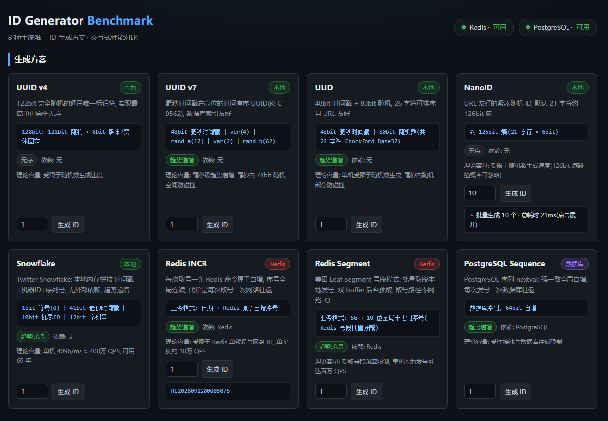
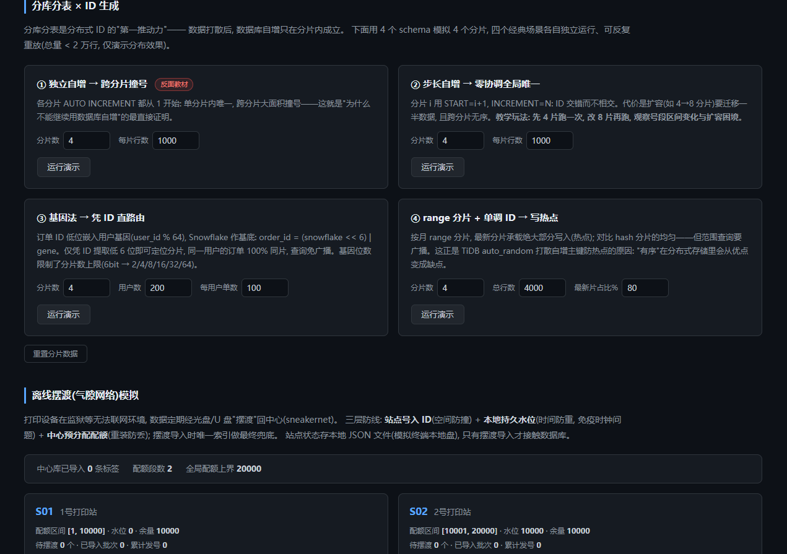
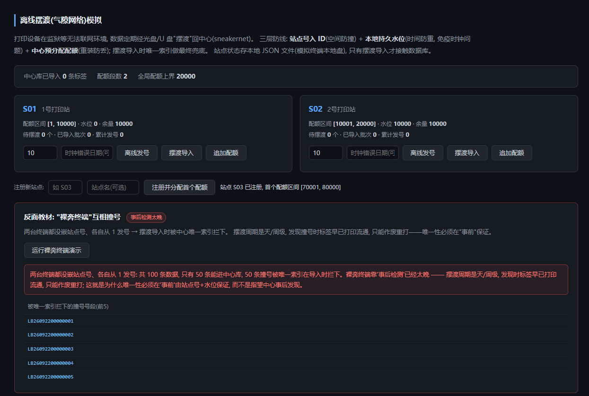

# ID 生成方案性能对比基准

[](https://www.python.org/)
[](https://fastapi.tiangolo.com/)
[](LICENSE)

**交互式对比 8 种主流唯一 ID 生成方案 —— Snowflake、UUIDv4、UUIDv7、ULID、NanoID、Redis INCR、Redis 号段模式(Leaf segment)、PostgreSQL 序列 —— 的性能表现,并提供实时延迟 / 吞吐仪表盘。**

[English](README.md) | [简体中文](README_zh-CN.md)

---

## 为什么要做这个项目

分布式系统里"ID 怎么生成"这个问题,大多数团队的答案是听来的:"直接 UUID 呗"、"Snowflake 太复杂了"。
但 ID 选型应该靠数据说话,而不是靠八股和传闻。
**id-generator-benchmark** 把 8 种主流 ID 生成方案放进**同一套**压测框架,在**你自己的机器**上跑,
用实时 Web 仪表盘并排呈现它们的延迟分位数(P50/P90/P99)、吞吐(QPS)和重复率。

项目面向三类人:

- **后端工程师**:为真实服务选型时,亲眼看到每一次网络往返的代价,看清"趋势递增"到底给数据库
  索引带来了什么。
- **面试备战**:每个方案都有一节深入剖析——位组成、优缺点、经典坑(Snowflake 时钟回拨、Redis key
  过期竞态、号段预取水位),让你在面试里能讲清"为什么",而不只是背名词。
- **分布式系统教学**:一个仓库,八个教科书级的"协调 vs 熵"权衡案例。

## 8 种方案总览

| # | 方案 | 位组成 | 趋势递增 | 依赖 | 理论容量 | 适用场景 |
|---|------|--------|----------|------|----------|----------|
| 1 | UUIDv4 | 128 bit = 122 随机 + 6 固定(版本/变体) | 否 | 无 | 2^122 ≈ 5.3×10^36 个取值 | 完全不在意顺序时的零依赖选择 |
| 2 | UUIDv7 | 48 bit 毫秒时间戳 \| 4 bit 版本 \| 12 bit rand_a \| 2 bit 变体 \| 62 bit rand_b | 趋势(毫秒) | 无 | 每毫秒 2^74 个;48 bit 毫秒时间戳可用约 8900 年 | 需要"对索引友好"的 UUID |
| 3 | ULID | 48 bit 毫秒时间戳 \| 80 bit 随机(26 字符 Crockford Base32) | 趋势(毫秒) | 无 | 每毫秒 2^80 随机空间 | 可排序、URL 安全的字符串 ID |
| 4 | NanoID | 21 字符 × 64 字符表 ≈ 126 bit 熵 | 否 | 无 | ~2^126 ≈ 8.5×10^37 个取值 | 更短的 URL 安全 ID、自定义字母表 |
| 5 | Snowflake | 0 \| 41 bit 时间戳 \| 10 bit 机器 ID \| 12 bit 序列号 | 是(趋势) | 无 | 单机 4096/ms × 1024 台机器;纪元起约 69 年 | 高 QPS 的 64 位整数 ID,数据库索引友好 |
| 6 | Redis INCR | 64 bit 原子计数器 key | 是(严格) | Redis | 单节点 Redis 吞吐(约 10 万 QPS,受网络制约) | 已有 Redis 时最简单的严格递增方案 |
| 7 | Redis 号段(Leaf 风格) | 预取号段,步长 1000 | 是(严格) | Redis | 每 1000 个 ID 摊薄为 1 次 Redis 调用;发号速度≈本地计数器 | 超高 QPS + 严格趋势,且不依赖时钟 |
| 8 | PostgreSQL 序列 | 64 bit bigint 序列(每次 `nextval` 发一个) | 是(严格,回滚有空洞) | PostgreSQL | 每个 ID 一次数据库往返;受连接池制约(典型约 1 万 QPS) | 以数据库为中心的栈里的集中式持久排序 |

## 快速开始

环境要求:**Python 3.11+**(在 3.13 上开发)。Docker 可选——本地方案(UUIDv4/v7、ULID、NanoID、
Snowflake)什么都不用装就能跑;Redis / PostgreSQL 方案在其服务可达后自动点亮。

```bash
# 1) (可选)启动依赖服务: PostgreSQL 16 映射到 :15432, Redis 7 映射到 :6380
docker compose up -d

#    用容器里的 Redis?给应用指到 6380 端口:
#      Windows (PowerShell):   $env:REDIS_PORT="6380"
#      Linux / macOS:          export REDIS_PORT=6380
#    (本机已经在 6379 跑了 Redis 的话,什么都不用设)

# 2) 安装依赖
pip install -r requirements.txt

# 3) 启动
python -m uvicorn app.main:app --reload

# 4) 打开仪表盘
#    http://localhost:8000
```

### 仪表盘截图

| 方案卡片 — 实时可用性、批量采样(可折叠) | 压测结果 — QPS 与延迟分位数图表 |
|---|---|
|  |  |
| 分库分表 × ID — 四个场景卡片(参数可调) | 离线摆渡 — 站点卡片、摆渡导入与撞号演示 |
|  |  |

### 配置项

全部通过环境变量覆盖,默认值见 `app/config.py`:

| 变量 | 默认值 | 说明 |
|------|--------|------|
| `REDIS_HOST` / `REDIS_PORT` / `REDIS_DB` | `localhost` / `6379` / `0` | Redis 地址(docker compose 映射到 **6380**) |
| `PG_HOST` / `PG_PORT` | `localhost` / `15432` | PostgreSQL 地址(与 docker-compose 一致) |
| `PG_USER` / `PG_PASSWORD` / `PG_DATABASE` | `postgres` / `postgres` / `idbench` | PostgreSQL 认证信息 |
| `SEGMENT_STEP` | `1000` | 号段步长(每次 Redis `INCRBY` 取多少个 ID) |
| `SNOWFLAKE_MACHINE_ID` | `1` | 10 bit 机器 ID(0–1023) |
| `SNOWFLAKE_EPOCH_MS` | `1704067200000` | 自定义纪元 = 2024-01-01 00:00:00 UTC |

## 压测方法学

测一个 ID 生成器,方法上稍不注意就会冤枉它(或者吹捧它)。本节说明压测框架到底做了什么——
以及它**自己**在什么情况下会成为瓶颈。

### 1. 计时前先预热连接池

客户端的第一批请求付出不只是操作本身的代价,还有 TCP 建连 + 认证 + 握手的代价。未预热的连接池
在并发冲击下会把一连串建连串行化,而这些一次性的卡顿全部落在延迟尾部——哪怕稳态请求一个都没那么慢,
P99 也被整个运行周期污染了。

本项目实测数据(Redis INCR,`total=5000`,`concurrency=50`):

| | P50 | P99 |
|---|---|---|
| 不预热(冷连接池) | 1.1 ms | **2056 ms** |
| `warmup()` 之后(满池) | 0.4 ms | **19 ms** |

一个纯粹的方法学伪影,把 P99 扭曲了约 100 倍。因此压测框架在**计时开始前**先调用
`gen.warmup(concurrency)`,把连接池建满到预期并发数,让计时阶段只测量 `generate()` 本身。

### 2. 用 `time.perf_counter_ns()` 逐次测延迟

每一次 `generate()` 调用都用纳秒级单调时钟单独包裹。报告里的分位数是**单个 ID** 的延迟,而不是
批平均——平均值恰恰会掩盖你选型时最关心的尾部行为。

### 3. 重复检测

所有生成的 ID 都写入一个由锁保护的全局 `set`,全线程共享。结果里把重复数与成功/失败数并列报告——
一个会产出重复 ID 的方案,无论 QPS 多高都是不合格的。

### 4. 线性插值分位数

P50/P90/P99 采用对排序后延迟列表做线性插值的方式计算(即 numpy 默认的 inclusive 方法),
在任何样本量下都表现稳定,不会在离散次序统计量之间跳变。

### 5. 诚实的局限声明:压测框架自身可能是瓶颈

这是一个用线程池(`ThreadPoolExecutor`)驱动的 Python 压测客户端。Python 的 GIL 加上锁保护的
簿记逻辑意味着:**本地方案**(UUIDv4、UUIDv7、ULID、NanoID、Snowflake)的数字里有相当一部分
测的是框架本身——函数调用、锁竞争、GIL 调度——而不是生成器。

请把本地方案的数字当作生产系统能达到的**下界**。真正有意义的是相同开销下的**相对**对比,因为
每个方案交的是同一份"框架税"。网络型方案(Redis、PostgreSQL)受影响小得多:工作线程阻塞在
socket I/O 上时会释放 GIL,测得的延迟由真实的服务端往返主导。

### 6. 环境说明:Windows 原生版 Redis 有偶发尾延迟尖刺

如果把 `REDIS_HOST` 指向 Windows 原生移植版 redis-server,即使连接池已完全预热,也偶发单个
请求 ~2 秒的停顿——该移植版的事件循环偶尔会延迟处理新连接。这是服务端构建的问题,不是 ID
方案的问题。要获得有代表性的 Redis 延迟分位数,请改用 Docker 或 WSL2 运行 Redis。

## 方案深度剖析

### 1. UUIDv4 —— 纯随机,零依赖

```
128 bit:   [ 122 bit 随机 ................ | 版本=4 | 变体 | 随机 ]
hex 形式:  xxxxxxxx-xxxx-4xxx-yxxx-xxxxxxxxxxxx   (y ∈ {8,9,a,b})
示例:      31d3449a-9f2e-4c2b-b8f1-6e0a5c9d8e7f
```

UUIDv4 用 CSPRNG 填充 128 bit 中的 122 bit,剩下 6 bit 是协议固定开销(4 bit 版本字段 `0100`,
2 bit 变体字段 `10`)。碰撞概率天文数字级地小:要有 50% 概率出现**任意一次**碰撞,需要先生成约
2.7×10^18 个 ID。

代价则是完全无序。相邻两个 UUIDv4 毫无关系,所以 UUIDv4 列上的 B-tree 索引每次写入都是随机位置
插入:缓存局部性差、页分裂频繁、碎片只增不减。大表场景下,这就是写放大的主要来源。

- 优点:无协调、无基础设施、不依赖时钟;碰撞风险可忽略;人人看得懂。
- 缺点:36 字符 hex 字符串(存储与索引偏大);随机插入使 B-tree 索引碎片化;不含任何时序信息,
  排查问题和分页都用不上。

代码:[`app/generators/uuid_v4.py`](app/generators/uuid_v4.py)

### 2. UUIDv7 —— 时间有序的 UUID

```
 0                47 48 51 52            63 64 65 66                 127
+-------------------+------+--------------+----+----------------------+
|  unix_ts_ms (48)  | ver=7| rand_a (12)  |变体|     rand_b (62)      |
+-------------------+------+--------------+----+----------------------+
   自 Unix 纪元的毫秒数       固定位(变体 = 10xx)      CSPRNG
```

UUIDv7(RFC 9562)把 48 bit 毫秒时间戳搬进最高位,保住了 UUID 的外壳,却让取值**大致按时间排序**。
新行像自增主键一样追加在索引右端,而不是随机位置插入——这就是自增键对索引友好的那个性质,
还不用中央计数器。

不过排序只是毫秒粒度:同一毫秒内,随机尾部会把顺序打乱。对索引局部性无妨(同一毫秒的行落在同一批
索引页上),但它**不是**严格全序——既不能当变更流的游标,也不能靠"取最大值"去重。规范里 12 bit 的
`rand_a` 字段可选实现为单调计数器,用来补上同毫秒内的顺序,代价是引入进程内状态。

- 优点:对 UUIDv4 即插即换(列类型、工具链全兼容);趋势递增 → 索引局部性好;每毫秒 74 bit 随机,
  碰撞照样可以忽略。
- 缺点:仍是 36 字符;只有毫秒级顺序;同一毫秒内的两个 ID 无序。

代码:[`app/generators/uuid_v7.py`](app/generators/uuid_v7.py)

### 3. ULID —— 可排序、URL 安全的标识符

```
 01JMYPK5C2Q0 T7R9SBG6A4H8J2K5M0N7
+-------------+---------------------+
|   时间戳    |       随机部分      |
|   48 bit ms |       80 bit        |
|   10 字符   |       16 字符       |
+-------------+---------------------+
  Crockford Base32 (0-9 A-H J K M N P-T V-Z), 共 26 字符, 大小写不敏感, 无 I/L/U/O
```

ULID 与 UUIDv7 是同一个思路(48 bit 毫秒时间戳 + 随机),但编码成 26 字符的 Crockford Base32
字符串。由于编码保序(时间戳占据最高有效位置,Base32 字符的字典序与数值序一致),
**字符串排序 == 生成顺序**(跨毫秒)。对比 UUID:即便是时间有序的 UUIDv7,当字符串排序时也不保序,
必须先解码。

80 bit 随机尾部意味着每毫秒有 1.2×10^24 的空间,碰撞风险才会开始不为零;同一毫秒内仍是无序的。
工程上的实际收益:26 字符 vs 36 字符、没有连字符、URL 和文件名安全、大小写不敏感、在日志里一眼
能和 UUID 区分开。

- 优点:纯字符串即可字典序排序;更短且 URL 安全;ID 自带可读时间戳;对索引友好。
- 缺点:不是 UUID(有些工具链假定 UUID);同毫秒无序;128 bit 存成 26 字符比 bigint 宽。

代码:[`app/generators/ulid.py`](app/generators/ulid.py)

### 4. NanoID —— 更短、可定制

```
 21 个字符, 取自 64 字符表 [A-Za-z0-9_-]  →  21 × log2(64) ≈ 126 bit 熵
 示例:      V1StGXR8_Z5jdHi6B-myT_
```

NanoID 回答的是 UUIDv4 的"凭什么要 36 个字符"。用 64 符号字母表(URL 安全的 `A-Za-z0-9_-`),
21 个字符携带约 126 bit 熵——比 UUIDv4 的 122 bit 还略多——而字符串长度只有 58%。字母表是
一等公民参数:可以剔掉易混淆符号(`0`、`O`、`1`、`l`)方便人工抄录,也可以缩小字母表来适配
固定长度预算。相比 UUID 的 hex,NanoID 使用加密安全随机源,并采用无偏的取模映射。

顺序问题上它完整继承了 UUIDv4 的缺点——纯随机、无时间戳、无任何信息。它的生态位正是 UUIDv4
原本的位置,只是字符串更短、更友好。

- 优点:常见随机 ID 里最短;URL/文件名安全免转义;字母表与长度可调;无协调。
- 缺点:随机插入(和 UUIDv4 一样的索引碎片化);标准化程度不如 UUID;顺序无意义。

代码:[`app/generators/nanoid.py`](app/generators/nanoid.py)

### 5. Snowflake —— 64 bit 趋势递增整数

```
 1 bit        41 bit                            10 bit          12 bit
+-----+-----------------------------------+----------------+----------------+
|  0  |   自定义纪元以来的毫秒数          |    机器 ID     |    序列号      |
+-----+-----------------------------------+----------------+----------------+
  符号位    1704067200000 = 2024-01-01 UTC   0-1023           每毫秒 0-4095
```

Twitter 的 Snowflake 把趋势递增的 ID 塞进一个带符号 64 bit 整数:41 bit 毫秒时间戳(相对自定义
纪元——本项目 `SNOWFLAKE_EPOCH_MS = 1704067200000`,即 2024-01-01 UTC,可用到约 2093 年)、
10 bit 机器 ID(1024 个节点)、12 bit 毫秒内序列号(每机每毫秒 4096 个,约 400 万 QPS/节点)。
每个节点**零网络调用**独立发号,理论容量就是"单机 4096/ms",实际瓶颈只在于机器调用函数的速度。

高位是时间戳,所以 Snowflake ID 按生成顺序排序(多节点间有轻微交叉),让 B-tree 索引获得接近
自增主键的"尾部追加"行为——同时覆盖 1024 台机器且互不协调。机器 ID 必须全节点唯一:两个节点
共用一个 ID 会安静地产出重复,所以真实部署要么用 ZooKeeper/Consul 分配,要么静态规划。

**时钟回拨处理。** Snowflake 的命门是系统时钟。NTP 把时钟往回调时,朴素实现会重新进入一个已经
发过号的毫秒——时间戳相同、机器 ID 相同、序列号从 0 重来 → **重复 ID**。本实现显式处理回拨:

- 回拨 ≤ **5 ms**(容忍阈值):生成器自旋等待,直到真实时间追上一次见过的最大时间戳,然后继续
  发号——正确性保住,延迟暂时抬高。
- 回拨 > 5 ms:**直接抛错,不发 ID**。安静地产出重复是最坏的失败方式;响亮地失败,把修时钟的
  决定交还给运维。
- 同一毫秒内序列号耗尽(>4096 个):同样自旋等到下一毫秒,而不是让序列号溢出。

- 优点:无网络依赖、无单点;单机 4096/ms;64 bit 整数(8 字节)——所有趋势递增方案里存储最小、
  索引最快。
- 缺点:要求机器 ID 唯一且时钟有纪律(NTP 平滑调整,禁止跳变);泄露时间与机器信息;回拨超阈值
  时停止发号。

代码:[`app/generators/snowflake.py`](app/generators/snowflake.py)

### 6. Redis INCR —— 原子计数器,每个 ID 一次往返

```
   key "id:{name}"  ──►  [ 64 bit 整数 ]
   INCR  →  1, 2, 3, ...  任意并发下严格递增、原子
```

Redis 单线程执行命令,所以 `INCR` 天生原子:任意客户端、任意连接,拿到的都是唯一且严格递增的数。
协调逻辑一行不用写,理论上限就是 Redis 自身吞吐——实践中单节点跑简单命令约 10 万 QPS,
而每个 ID 的成本恰好是**一次网络往返**。

一个运维陷阱:裸计数器 key 永不过期。压测和短命环境会把 key 无限泄漏下去。因此本生成器用一段
**在 Redis 内原子执行的 Lua 脚本**——先 INCR,若结果是 1(该 key 首次使用)再为它设置过期时间。
把 INCR 和 EXPIRE 放进**同一次 Lua 调用**正是关键:客户端拆成两条命令存在竞态(中间崩溃 → 永生
key),而 Lua 保证在服务端原子执行、没有时间窗。

- 优点:极简;严格递增;所有服务共享即刻全局唯一;发号速率只受 Redis 吞吐制约。
- 缺点:硬依赖 Redis,且 Redis 成为单点;每 ID 一次 RTT,延迟=网络往返(压测里的主导项);
  容灾必须考虑计数器丢失(持久化配置)——空数据重启意味着重发旧 ID,除非配好持久化/复制。

代码:[`app/generators/redis_incr.py`](app/generators/redis_incr.py)

### 7. Redis 号段模式(Leaf 风格)—— 把网络往返摊薄

```
   Redis:  INCRBY id:{name} 1000  ──►  返回新号段上界
                                     例如 3000  →  拥有 (2001..3000]
   应用:   在内存中从号段原子递增发号

   当前号段                    下一号段(50% 水位时预取)
   [2001 ......... 3000]      [3001 .............. 4000]
              ^ 剩余 < 步长的一半 → 启动异步预取
```

美团 Leaf 让号段模式出了名:与其每个 ID 都访问一次 Redis,不如一次取**一批**。本项目用
`INCRBY key 1000`(`SEGMENT_STEP = 1000`)原子地预留下一个 1000 宽度的号段,ID 生成退化为
本地原子计数器在段内递增——单 ID 成本从一次网络往返坍缩到千分之一次,QPS 逼近纯本地方案,
同时保住 Redis 协调下的严格递增序。

难点在于补段:号段用尽时,朴素实现会**阻塞**在一次 Redis 往返上,而这次卡顿全部落进尾部延迟。
Leaf 的答案是**双 buffer**:当前号段还在发号时,后台就开始准备*第二*个号段。本实现在当前号段
消耗过半(剩余跌破 **50% 水位**)时触发预取,等当前号段耗尽,下一段已在内存里,切换零阻塞。
如果流量快到预取还没完成号段就耗尽了,发号会等待预取完成——性能退化但正确性不变。

- 优点:严格趋势序 + 接近本地的 QPS;Redis 压力除以步长;不需要时钟和机器 ID 纪律;Redis 短暂
  故障时当前号段还能撑一阵。
- 缺点:进程死在号段中间时,整段 1000 个号都作废(有空洞,绝不重复);50% 水位保证突发流量下预取有
  余量;"严格递增"是**按 key** 的——多个实例要共享序列就必须共享同一个 key。

代码:[`app/generators/redis_segment.py`](app/generators/redis_segment.py)

### 8. PostgreSQL 序列 —— 锚定在数据库里的顺序

```
   CREATE SEQUENCE id_seq AS bigint;        -- 64 bit, 上限 2^63 - 1
   SELECT nextval('id_seq');                -- 1, 2, 3, ...  每个 ID 一次往返
```

数据库序列是最早的"集中式发号服务"。PostgreSQL 在自己的锁与持久化保证下发号,每次 `nextval()`
返回唯一且严格递增的 64 bit 整数——而且它就**活在数据库里**,ID 的顺序与使用它的事务一致:
不引入新基础设施,可靠性由保护你数据的同一份 WAL 兜底。

有两个性质必须说精确。第一,序列是**非事务性**的:回滚事务里已经执行的 `nextval()` *不会归还*,
所以序列严格递增但**不保证无空洞**——回滚和缓存都会留下缺口。对生成 ID 来说几乎无所谓;
对法律要求连号的发票号,不行。第二,每个 ID 耗一次数据库往返,并与真实业务查询抢连接,
吞吐大致封顶在单池 1 万 QPS——整个方案与主库共生死。

- 优点:锚定在持久存储上的真严格序;对以数据库为中心的栈零新增设施;bigint 存储;失败模式
  可理解。
- 缺点:每 ID 一次 RTT 且受数据库制约;主库成为发号瓶颈与单点;回滚留洞;序列分库很别扭。

代码:[`app/generators/db_sequence.py`](app/generators/db_sequence.py)

## 分库分表 × ID:数据打散之后,标识符从哪来、往哪放

分库分表是分布式 ID 的"第一推动力"——数据一旦打散,数据库自增的唯一性**只在分片内成立**。
仪表盘的「分库分表 × ID 生成」板块用 PostgreSQL 的 N 个 schema 模拟 N 个分片,现场演示这一点。
每个场景自包含(可反复重放,自动清空重置),**参数全部可自定义**——分片数/行数/用户数/热点占比
直接在卡片上改,重新运行即可。每个场景只使用与该场景匹配的 ID 方法:这是教学演示,
不是强行让 8 种方案都参赛。

| # | 场景 | 你会看到什么 | 教学要点 | 可调参数 |
|---|------|--------------|----------|----------|
| 1 | 独立自增(反面教材) | 同一个 `L00000001` **同时存在于每个分片**——跨分片几乎全撞 | 分库分表后为什么不能继续用数据库自增;分布式 ID 的起源故事 | 分片数(1–16)、每片行数 |
| 2 | 步长自增 | shard0 发 1,5,9…;shard1 发 2,6,10…——交错不相交,**零协调**全局唯一 | 静态规划换运行时协调:扩容 4→8 片要迁移一半数据且原 ID 冻结。先跑 4 片再跑 8 片,亲眼看号段区间变化 | 分片数、每片行数 |
| 3 | 基因法(雪花作基底) | `order_id = (snowflake << 6) \| (user_id % 64)`;提取低 6 位即可直路由。同一用户 100% 同片 | ID 可以**自带路由信息**,免广播查询、免映射表。代价:基因位数限制分片数上限(64 的约数) | 分片数、用户数、每用户订单数 |
| 4 | range 分片 + 单调 ID | 按月 range 分片,最新分片承载 80%+ 写入(热点条变橙);hash 分片完全均匀但范围查询要广播 | "有序"在分布式存储里从优点变成缺点——这正是 TiDB 加 `auto_random` 打散自增主键的原因 | 分片数、总行数、热点占比% |

**条形图配色**:橙色=热点分片,蓝色=均匀分布,红色=撞号。

## 离线摆渡(气隙网络):网络永远到不了的地方怎么发号

有些打印设备装在监狱、军工厂、偏远变电站——机器**永远**连不上你的网络,数据靠人
定期用光盘/U 盘"摆渡"回来(air-gapped deployment / sneakernet),周期是天/周级。
冲突发现从"毫秒级"(一次 Redis 往返)变成"周级"(下一次摆渡),所以唯一性必须
**靠机制事前保证,而不是靠检测事后发现**。

仪表盘的「离线摆渡模拟」板块端到端模拟这个过程。站点状态存在本地 JSON 文件
(模拟各终端的本地盘),**只有摆渡导入时才接触数据库**——与真实拓扑一致。

**三层防线**(每一层的失效模式由下一层兜住):

| 层 | 防的是什么 | 原理 |
|----|-----------|------|
| 1. 站点号嵌入 ID | 跨站撞号 | 每台终端装机时分配中心登记的站点号;ID 形如 `LB260922S0100000042`(前缀·日期·站点·序号) |
| 2. 本地持久水位 | 重启/时钟乱套后重发号 | 序号来自本地盘上的单调水位,**永不回退**;日期字段只作展示——试试"时钟错误日期"输入框(填 `2020-01-01`),看日期错了但 ID 依旧唯一 |
| 3. 中心预分配配额 | 重装机器丢水位 | 每站点从预分配的配额区间发号(如 S01: 1–10,000,S02: 10,001–20,000);耗尽后中心追加新区间,随**下一次**摆渡带回——号段模式的离线极限形态:段大小 = 一个摆渡周期的用量 |

**最终兜底**:摆渡导入时中心库 `UNIQUE` 索引做冲突检测。三层防线完好时它**一次都不该触发**。
演示的"反面教材"卡片会跑两台裸奔终端(没嵌站点号、各自从 1 发号)——看唯一索引在
"标签早已打印流通"数周之后才把撞号拦下,这正是事后检测太晚的原因。

**气隙环境的时钟**:终端 ID 里的时间戳来自**它自己的**系统时钟(硬件 RTC → 系统时间 →
时间戳),没有两台机器的漂移是一样的。单站内排序可信;跨站永远别比时间戳——用摆渡批次号。
真实部署的机会性校时:摆渡介质携带权威时间,或用 GPS/电波授时硬件把漂移压到接近零,
全程不需要网络。

代码:[`app/sharding.py`](app/sharding.py)、[`app/offline.py`](app/offline.py)——演示数据刻意
很小(每场景 ≤ 2 万行,远不构成数据库压力)。

## API 参考

| 方法 | 路径 | 说明 |
|------|------|------|
| `GET` | `/` | 仪表盘页面(`web/index.html`) |
| `GET` | `/api/health` | 依赖可用性:`{"redis": bool, "postgres": bool}` |
| `GET` | `/api/generators` | 全部 8 个方案的元数据、实时可用性与现生成样例 |
| `POST` | `/api/sample/{name}` | 生成一个 ID:`{"name": ..., "id": ...}` —— 未知方案 `404`,依赖不可用 `503` |
| `POST` | `/api/benchmark` | 执行压测(请求体见下),返回各方案的 `BenchmarkResult` |
| `POST` | `/api/sharding/init` / `reset` | 建分片 schema / 清空演示数据 |
| `POST` | `/api/sharding/scenario/{independent\|step\|gene\|hotspot}` | 运行分片场景;query 参数 `shards`/`rows`/`users`/`orders`/`total`/`pct` 服务端自动夹紧 |
| `GET` | `/api/offline/sites` | 离线站点总览 + 中心导入统计 |
| `POST` | `/api/offline/issue` | 离线发号(只动本地水位;`fake_date` 可模拟终端时钟错误) |
| `POST` | `/api/offline/allocate` | 中心为站点追加新配额区间 |
| `POST` | `/api/offline/register` | 注册新的离线站点 |
| `POST` | `/api/offline/import/{site_id}` | 摆渡导入(唯一索引冲突检测) |
| `POST` | `/api/offline/demo-collision` | 反面教材:两台无站点号终端互相撞号 |

`POST /api/benchmark` 请求体:

```json
{
  "generators": ["snowflake", "uuid_v7", "redis_segment"],
  "total": 5000,
  "concurrency": 50
}
```

`generators` 省略或为 `null` 时压测**全部可用**方案;不可用的方案名会列入 `"skipped"`。
`total` 上限 200000,`concurrency` 上限 512,越界自动夹紧。示例:

```bash
curl -X POST http://localhost:8000/api/benchmark \
  -H "Content-Type: application/json" \
  -d '{"generators": ["snowflake", "redis_incr", "redis_segment"], "total": 10000, "concurrency": 64}'
```

## 选型结论

一条简短的决策路径——完整论证见上文各节:

```
 Q1: ID 需要按时间有序 / 对数据库索引友好吗?
 |__ 否 --> Q2: 有理由引入进程外协调吗?
 |           |__ 否   --> UUIDv4(通用)或 NanoID(更短、URL 安全)
 |           |__ 是   --> 只要唯一性的话,任何方案都行,
 |                        挑最便宜的: UUIDv4
 |
 |__ 是 --> Q3: 可以引入基础设施(Redis / PostgreSQL)吗?
             |__ 否(仅进程内)
             |        --> Q4: 需要毫秒级严格顺序 + 最高 QPS?
             |                  |__ 是 --> Snowflake(需唯一机器 ID、
             |                  |        时钟纪律;只能是整数)
             |                  |__ 否 --> UUIDv7 / ULID(毫秒级有序,无协调)
             |
             |__ 是 --> Q5: 顺序要严格到什么程度?
                        |__ 严格递增,可容忍空洞
                        |     |__ 已有 Redis?
                        |     |     |__ QPS < 约 5 万  --> Redis INCR(最简单)
                        |     |     |__ QPS 更高       --> Redis 号段(Leaf 风格)
                        |     |__ 以 PostgreSQL 为中心、QPS 适中
                        |           --> PostgreSQL 序列
                        |__ 趋势递增就够
                              --> Snowflake(整数)或 UUIDv7(UUID 形态)
```

压测之后沉淀下来的几条经验法则:

- **新服务的默认答案:UUIDv7**——索引友好、零依赖、一句话讲得清。
- **要高 QPS 的 64 位整数:Snowflake**——但要为机器 ID 分配和时钟纪律做预算,并理解 5 ms 回拨
  行为。
- **已有 Redis 且要严格递增:号段模式**——接近本地的 QPS、摊薄后的网络往返、双 buffer 藏住补段
  延迟。
- **简单压倒吞吐时用 Redis INCR**:一次原子操作、一次往返,结束。
- **以数据库为中心且 QPS 适中时用 PostgreSQL 序列**——永远不要只为发号就往技术栈里硬塞一个
  Redis,除非先测过。

## 参与贡献

欢迎贡献。新增一个方案的门槛刻意做得很低:

1. 在 `app/generators/` 下继承 `BaseIDGenerator`,实现 `generate()`
   (方案有依赖的话,再实现 `check_ready()` / `warmup()` / `close()`)。
2. 在 `app/generators/__init__.py` 的 `REGISTRY` 里注册类。

仪表盘和所有 API 路由会自动发现它。关于方法学(尤其是测量伪影)的 bug 报告,和新生成器一样
有价值。

## 许可证

以 [MIT License](LICENSE) 发布。

## English Documentation

本文档亦有英文版:[README.md](README.md)。
